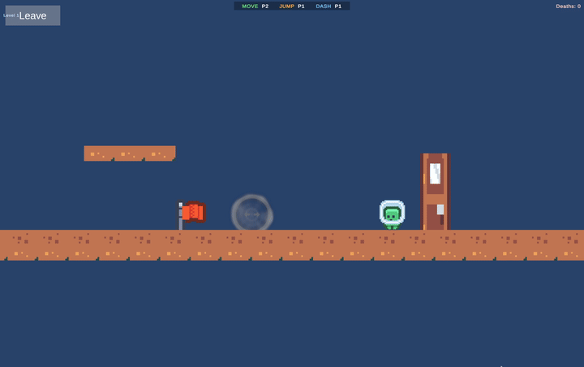
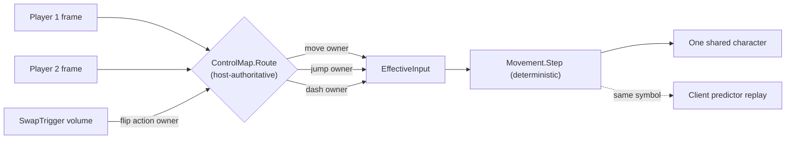
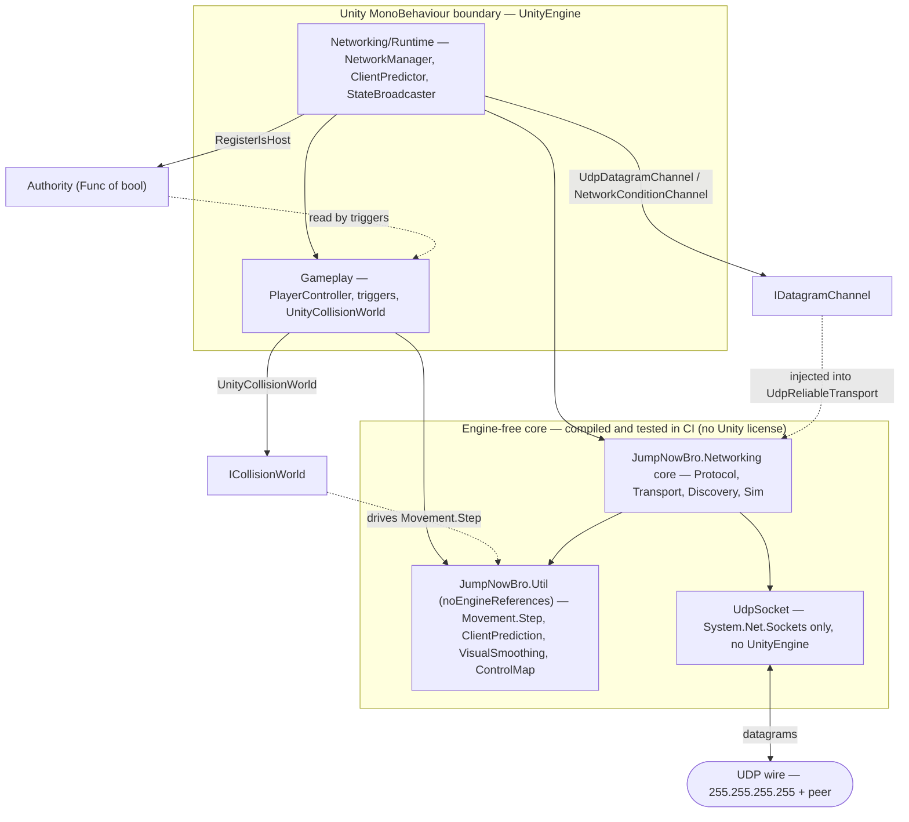

# Jump Now Bro!

> A 2D LAN co-op platformer where **two players share control of one character**. Triggers
> throughout the level swap which player drives which inputs — coordinate or fall.

**Applied Networks final project.** The game is a vehicle for the interesting part: a **hand-rolled
UDP networking stack** — protocol design, a custom reliability layer, LAN discovery, client-side
prediction, and a reliable event channel that carries the control-swaps. No Netcode for GameObjects,
no Mirror, no Photon, no Unity multiplayer services. Every byte on the wire is custom code over
`System.Net.Sockets.UdpClient`.

## Highlights

- **Host-authoritative listen-server** over raw UDP — one machine runs the only simulation; the other
  forwards input and renders state.
- **Reliability keyed on a per-*message* sequence number** (not the packet sequence), so a reliable
  control-swap survives loss and reordering *without* head-of-line-blocking the unreliable input/state
  stream on the same socket.
- **Two channels by strict discipline:** `INPUT`/`STATE` are lossy latest-wins; `HELLO`/`EVENT`/`GOODBYE`
  are sequenced, acked, and retransmitted.
- **Input survives loss with redundancy, not retransmission** — a K=6 window + edge-bit OR-ing lands a
  jump/dash press through several consecutive drops.
- **Client-side prediction + reconciliation** on the deterministic movement core; host-owned motion
  *interpolated* (not extrapolated) so it never jitters or rubber-bands on reversals.
- **Control swaps apply on a shared client-input-tick**, so both HUDs flip on the *same logical tick*,
  not ~RTT apart.
- **The whole netcode + simulation core is engine-free C#**, unit-tested in a **no-Unity CI** (no Unity
  license) with a golden-master determinism check.

## Stack

- **Engine:** Unity 6.4 (6000.4.7f1), Universal 2D / URP — rendering, physics, input polling, main loop only.
- **Language:** C#
- **Networking:** raw UDP via `System.Net.Sockets.UdpClient` with a custom reliability layer on top.

## The mechanic: shared control

The character has a small fixed action set — **Move (left/right)**, **Jump**, **Dash**. A host-owned
`ControlMap` assigns each action to a player (P1 or P2); exactly one player owns each action at any
instant. Invisible **swap triggers** reassign ownership mid-platforming, so the moment-to-moment skill
check is *verbal coordination* as much as execution. At the start P1 owns everything; crossing a swap
trigger hands an action to P2.

In **LAN play the host drives Player 1 and the client drives Player 2**, each on their own keyboard.
**Solo on one machine**, you drive both halves yourself.

| Action | Player 1 | Player 2 |
|---|---|---|
| Move (left/right) | A / D | ← / → |
| Jump | Left Shift | Space |
| Dash | Left Ctrl | Right Shift |

## How it's built (at a glance)

Every byte of the netcode and the simulation it drives lives in **pure, engine-free C#** that compiles
and tests without a Unity license. Unity dependencies are *inverted, not imported*: the MonoBehaviour
layer registers real implementations back into the core through three narrow seams (`Authority`,
`IDatagramChannel`, `ICollisionWorld`).

## Documentation

The deep dives — with the full set of diagrams — live in [`docs/`](docs/):

- **[Networking](docs/networking.md)** — the hand-rolled UDP stack: packet format, the per-message
  reliability layer, INPUT redundancy, client prediction & reconciliation, the control-swap `EVENT`,
  session lifecycle & LAN discovery. *(The core of the project.)*
- **[Architecture](docs/architecture.md)** — the engine-free, CI-tested core; the asmdef boundary and
  the three inversion seams; the no-Unity CI and golden-master determinism test; project structure.
- **[Gameplay & movement](docs/gameplay.md)** — Celeste-tight feel, the deterministic movement state
  machine, and the shared-control design.

## Running it

### Build & play

1. Install **Unity 6.4 (6000.4.7f1)** via Unity Hub.
2. Unity Hub → **Add** → select the cloned repo.
3. Open `Assets/Scenes/Bootstrap.unity` and press **Play** — it loads Level 1 additively and spawns the
   player. *Always start from `Bootstrap`*; the persistent managers live there.
4. For a standalone build, use **File → Build Profiles** (macOS or Windows). The scene list (`Bootstrap`
   at index 0 + the three levels) is already configured.

> Cloning with sprites intact needs **Git LFS installed before `git clone`** (binary assets are
> LFS-tracked). If you cloned without it: `git lfs install && git lfs pull`.

### LAN play

Start every instance from `Bootstrap.unity`; the main menu drives the session:

- **Host** — set a **lobby name** (defaults to the machine name), then host. Binds the gameplay port,
  broadcasts the discovery beacon, runs the only authoritative simulation, and drives Player 1.
- **Join** — pick a host from the auto-discovered **LAN games** list, or enter the host's IP manually
  (default `127.0.0.1` for same-machine testing). The client drives Player 2.
- **Solo** — single-player on one machine (drive both input halves yourself).
- **Leave** — graceful disconnect (sends `GOODBYE`) back to the menu.

If a peer drops, the surviving side pauses with a "connection lost" overlay: the client can **Rejoin**
(resuming into the host's current level) or return to the menu; the host keeps its progress and waits.

**Two-machine play** needs two people — only the focused OS window receives keyboard input. For solo
iteration, [ParrelSync](https://github.com/VeriorPies/ParrelSync) runs two editor instances against
`127.0.0.1`.

### Network-condition simulator (testing)

An **editor-only** simulator wraps each instance's outbound channel to inject latency/loss. In the menu's
idle state the `Sim:` button cycles **Clean / Fair / Stress** — set it per instance before Host/Join.
Profiles are one-way latency / jitter / loss: **Fair** ≈ 75 ms / 20 ms / 5%, **Stress** ≈ 125 ms / 50 ms
/ 10% (RTT ≈ 2× the one-way latency). It compiles out of player builds. See
[docs/networking.md](docs/networking.md#session-lifecycle-lan-discovery--failure-recovery) for details.

## Status

Phase 1 (single-player, local) and Phase 2 (the hand-rolled UDP layer) are both complete: LAN host/join
with broadcast discovery and named lobbies, host-authoritative simulation, client-side prediction +
reconciliation, reliable control-swap / death / level-transition `EVENT`s scheduled to a shared tick,
graceful connection-loss handling with rejoin, and a visual pass (slime/stone/portals, a UGUI main
menu). Verified in two-instance testing under the in-editor latency/loss simulator and on a real
two-machine LAN.

## License

No license — private project for academic submission.
