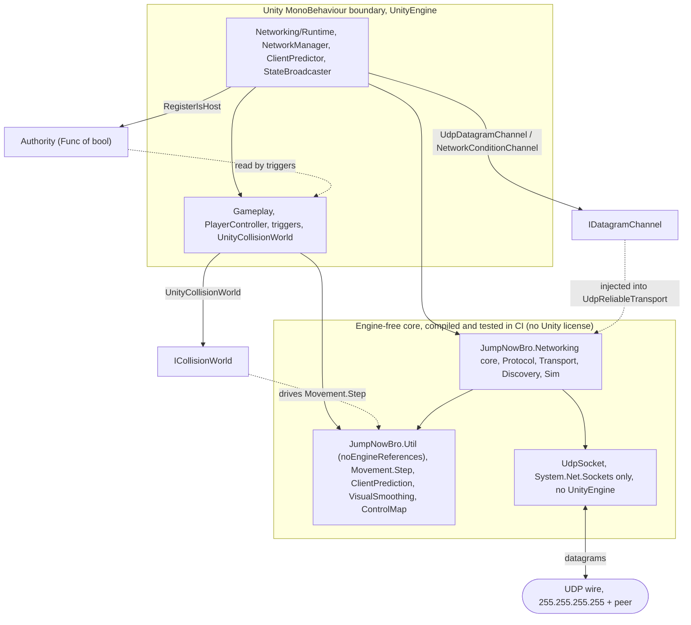
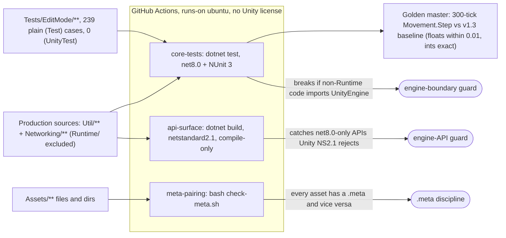

# Architecture

[← README](../README.md) · [Networking](networking.md) · **Architecture** · [Gameplay](gameplay.md)

The codebase is split into four Unity assembly definitions arranged so the simulation- and
network-critical logic is **pure, engine-free C#** that compiles and tests without a Unity license.
`JumpNowBro.Util` is `noEngineReferences` with zero references: the deterministic `Movement.Step` plus the
client prediction/reconciliation/smoothing logic. `JumpNowBro.Networking` (everything except its `Runtime/`
folder) is the transport/protocol core: it touches Unity only through a tiny `IDatagramChannel` byte-pipe,
and even its real `UdpSocket` uses only `System.Net.Sockets`. The thin MonoBehaviour adapters under
`Networking/Runtime` and all of `Gameplay` are the only Unity-bound code.

## The engine-free core vs the Unity boundary

Unity dependencies are **inverted, not imported**: instead of the core calling into `UnityEngine`, the Unity
layer registers implementations back into the core through three narrow seams. Each seam has a real Unity
implementation for play and a fake/in-memory one for tests, so the exact same core code runs on the wire and
in a headless test.



<sub>The wire and the simulation core stay engine-free; Unity attaches only through three registration seams (`Authority`, `IDatagramChannel`, `ICollisionWorld`).</sub>

## The three seams

- **`Authority`**, a `static Func<bool>` defaulting to host-true. `NetworkManager` registers the real
  check at `Awake`; the four trigger volumes (`SwapTrigger`, `Checkpoint`, `Hazard`, `LevelGoal`) gate
  authoritative mutations on `Authority.IsHost`, so a client's STATE-rendered body fires no local
  swaps/deaths/loads. Because the default is host-true, the same triggers work in single-player and in tests
  with no networking wired up at all.
- **`IDatagramChannel`**, the raw byte pipe (`Send(ReadOnlySpan<byte>)` / `TryReceive(out byte[])`). Three
  implementations: `UdpDatagramChannel` over a real `UdpSocket` in play, `NetworkConditionChannel` (the
  editor latency/loss decorator), and a test-only paired in-memory channel with deterministic drop/reorder
  hooks. `UdpReliableTransport` takes the seam in its constructor and never knows which is behind it.
- **`ICollisionWorld`**, engine-free collision queries (`Grounded` / `SweepX` / `SweepY`) taking explicit
  `(x, y)` so `Movement.Step` is replayable from arbitrary state. `UnityCollisionWorld` (Physics2D) backs it
  in play; the EditMode tests and golden master inject fakes.

The reference graph is strictly one-way: `Networking → { Gameplay, Util }`, `Gameplay → Util`, `Util → ∅`.
`Util` sits at the bottom and never sees Unity or Gameplay. (`ControlMap` lives in `Util`, not Gameplay, that placement is what lets the engine-free transport core pack and route control maps without referencing
Gameplay.)

## Testing & CI

The whole core is engine-free precisely so it can be tested **without a Unity license**. A GitHub Actions
workflow runs three license-free jobs, each defending a different invariant: `dotnet test` over **239
plain-NUnit tests** (the same files Unity runs, zero `[UnityTest]`) on net8.0, a **netstandard2.1
compile-only** job that catches net8.0-only API calls Unity's NS2.1 would reject, and a `.meta`-pairing
check. Both compile jobs glob the production sources and explicitly **exclude `Networking/Runtime`**, so the
day any non-Runtime file imports `UnityEngine` the build breaks. The engine boundary is enforced
mechanically, not by convention.

A **tolerance-based golden master** runs a 300-tick scripted input sequence through `Movement.Step` against a
baseline: float columns (position, velocity, timers) compared within 0.01 to absorb cross-runtime last-bit
drift (Mono on macOS vs .NET 8 on Linux CI accumulate `pos += vel*dt` slightly differently), integer/enum
columns (state, facing, dash charge, edge flags) must match exactly because any change there is a real
behavioral regression. That split is what lets a determinism test run trustworthily on a different runtime
than the game ships on.



<sub>Three license-free CI jobs defend the boundary: net8.0 tests + the determinism golden master, an NS2.1 compile-only API check, and a `.meta`-pairing script.</sub>

In-editor **PlayMode tests** exercise the Physics2D-dependent paths (real prefab/scene loading, trigger
firing) that can't run headless; they live under `Tests/PlayMode/` and run in the Unity Test Runner.

## Project structure

```
Assets/Scripts/
  Util/                 engine-free core, Movement.Step, ClientPrediction, VisualSmoothing,
                        ControlMap, Authority, NetworkInputRing  (no UnityEngine; CI-compiled)
  Networking/
    Protocol/           PacketHeader, ByteReader/Writer, message types, SeqMath
    Transport/          UdpReliableTransport, AckSystem, ReliableSendQueue/ReceiveBuffer,
                        RttEstimator, IDatagramChannel, UdpSocket, NetworkConditionChannel
    Discovery/          DiscoveryService, LanBeacon, DiscoveredHosts
    Sim/                engine-free timing/scheduling (PendingSwapScheduler, broadcast timing, rings)
    Runtime/            Unity MonoBehaviour adapters, NetworkManager, ClientInputSender,
                        ClientPredictor, NetworkStateBroadcaster, ClientStateRenderer,
                        SwapScheduleDriver, TickClock, MainMenuUI, ConnectionUI
  Gameplay/             PlayerController, ControlMap store, SwapTrigger, Checkpoint, Hazard,
                        LevelGoal, LevelManager, PlayerSpawner, UnityCollisionWorld
  Tests/EditMode/       239 plain-NUnit tests (run in Unity + headless CI), incl. golden master
  Tests/PlayMode/       in-editor integration tests
Assets/Scenes/          Bootstrap + Level_01/02/03
ci/                     hand-maintained no-Unity test/api-check csproj + check-meta.sh
.github/workflows/      ci.yml, the three license-free jobs
```
