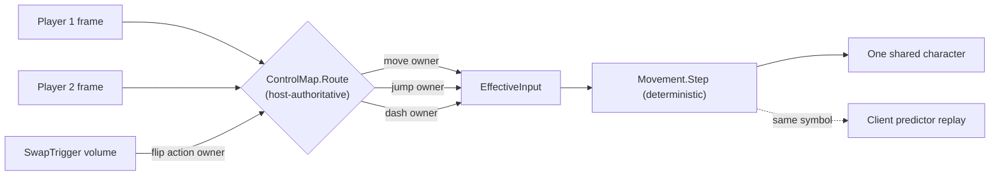
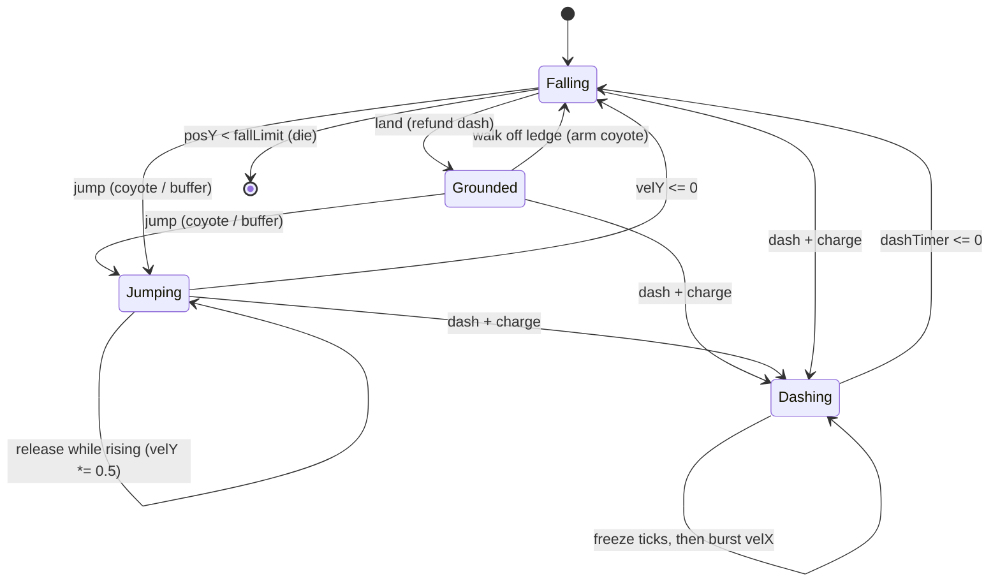

# Gameplay & movement

[← README](../README.md) · [Networking](networking.md) · [Architecture](architecture.md) · **Gameplay**

The character is driven by a single pure, engine-free state-machine step — `JumpNowBro.Util.Movement.Step` —
which both the host simulation and the client-side predictor call as the **same compiled symbol**. That
shared determinism is what makes client prediction and reconciliation possible at all (see
[Networking](networking.md#host-sim--client-prediction--reconciliation)), and it's why the core is
CI-testable and locked by a 300-tick golden master (see [Architecture](architecture.md#testing--ci)).

## Shared control

The shared-control mechanic is implemented as pure data: a host-owned `ControlMap` routes two raw input
frames into one `EffectiveInput`, and `SwapTrigger` volumes flip ownership mid-level. Keeping the map
host-authoritative (the client's copy is HUD-only) means the simulation never reads a value that could be
stale across the wire. The trigger fires a **static** cross-assembly event, so `Gameplay` never has to
reference the `Networking` assembly — preserving the clean Phase 1 / Phase 2 boundary.

Each action is owned by exactly one player; `SwapTrigger` volumes reassign ownership mid-level, and the routed input feeds the one deterministic step shared by host and client.

## Movement & feel

The feel is **Celeste-scoped, not Celeste-complete**: instant-accel horizontal run, a fixed-impulse jump
with **variable height** (release-to-halve while rising), **coyote time** and **jump buffering** (both
0.1 s) to forgive the input side, and a freeze-then-burst **dash** with one charge refunded on landing.
Wall jump/climb and 8-way dash are explicitly out of scope to keep the state machine small and the netcode
surface honest — the dash is horizontal-only for the MVP.

`Movement.Step` state machine: 0.1 s coyote/buffer forgiveness on jump, variable-height cut on release, one-charge dash refunded on landing, fall-limit death.

A subtle but load-bearing choice: the dash **freeze-frame is counted in ticks, not seconds**. Because client
reconciliation replays buffered ticks under a variable `dt`, a seconds-based freeze would drift between the
original sim and the replay; an integer tick count is rollback-stable. The same instinct drove separate float
fields in the wire `MovementState` (no `Vector2`) for an engine-free, replay-friendly layout. Per-tick
transitions are reported out-of-band as **edge flags** (Jumped / JumpCut / Dashed / Landed / Died) so the
presentation layer fires juice and death off explicit edges rather than diffing state.

## Hazards, checkpoints & levels

Hazards (spikes), checkpoints, and the level goal are thin **host-authoritative** trigger volumes — all gated
on `Authority.IsHost`, so the client's local collisions never desync state. Deaths arrive on the client via a
`STATE` death-count delta / `Death` `EVENT`; level loads via a `LevelLoad` `EVENT`. Death routes through one
0.4 s respawn coroutine (a fall below the fall-limit or a hazard touch both lead there), teleporting to the
last checkpoint via `transform.position` + `Physics2D.SyncTransforms` so the next-tick collision cast sees
the new pose immediately.

Three short levels (`Level_01/02/03`) load **additively over a persistent `Bootstrap` scene** — keeping
`Bootstrap` resident (and at build index 0) is what lets the byte-encoded scene index in the protocol stay
stable, and it's why you always start from `Bootstrap`. Starting tuning constants — run 9, jump 16,
gravity 50, coyote/buffer 0.1 s, dash 4 units over 0.15 s — live on a `PlayerTuning` ScriptableObject so they
can be iterated without touching code.
