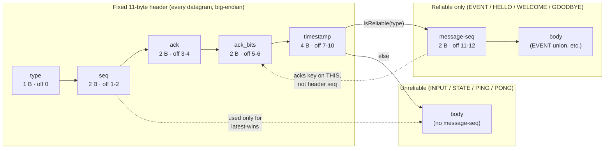
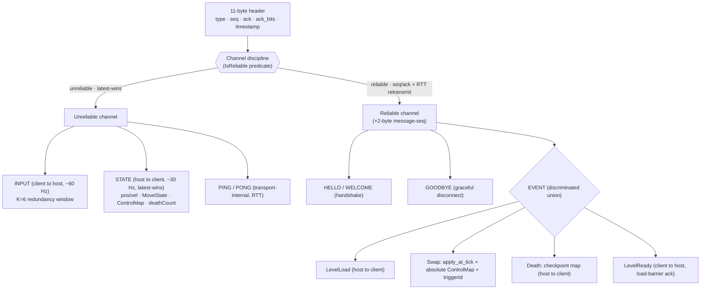
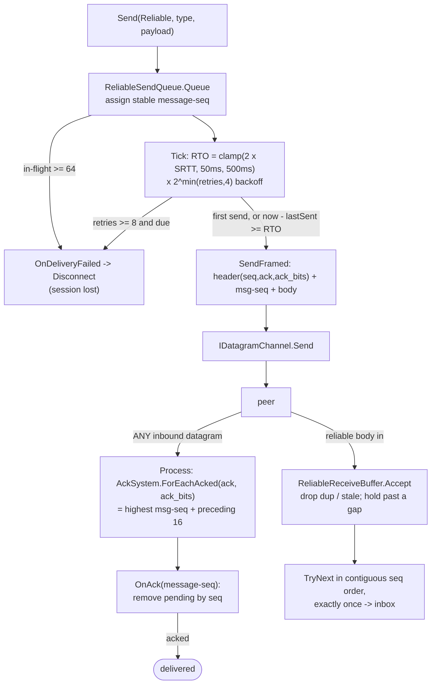
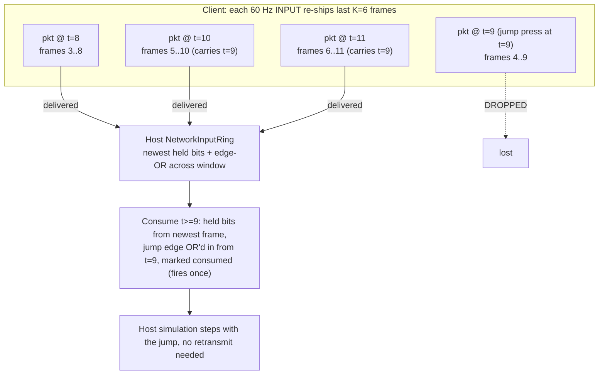
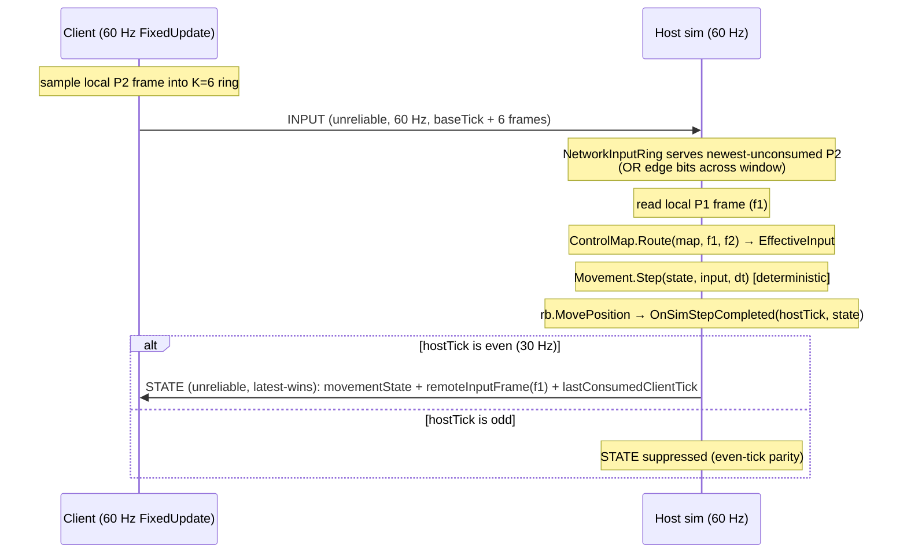
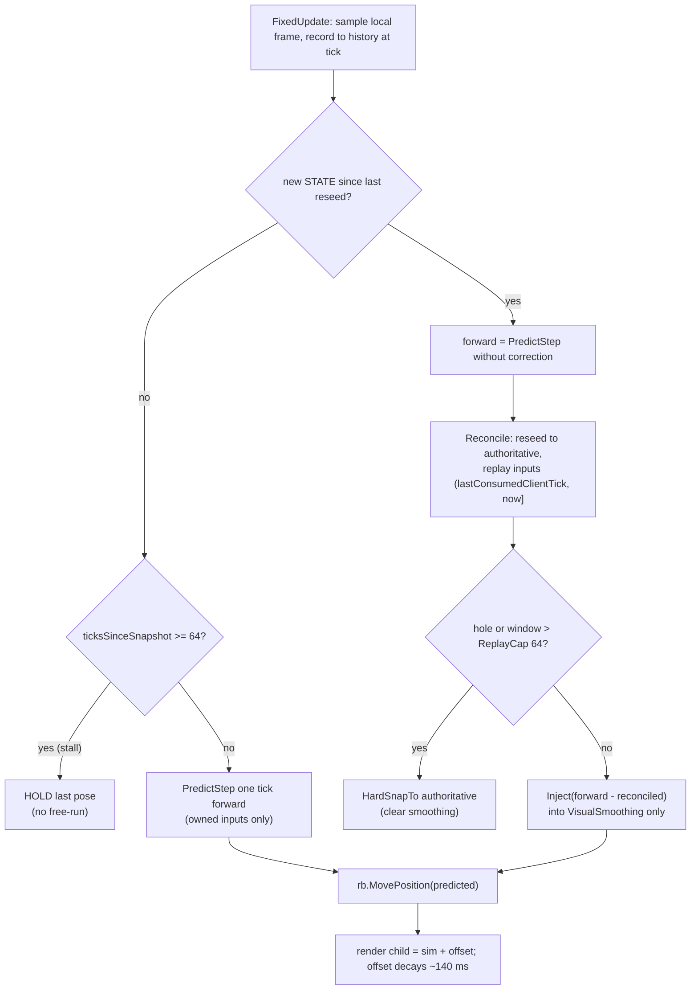
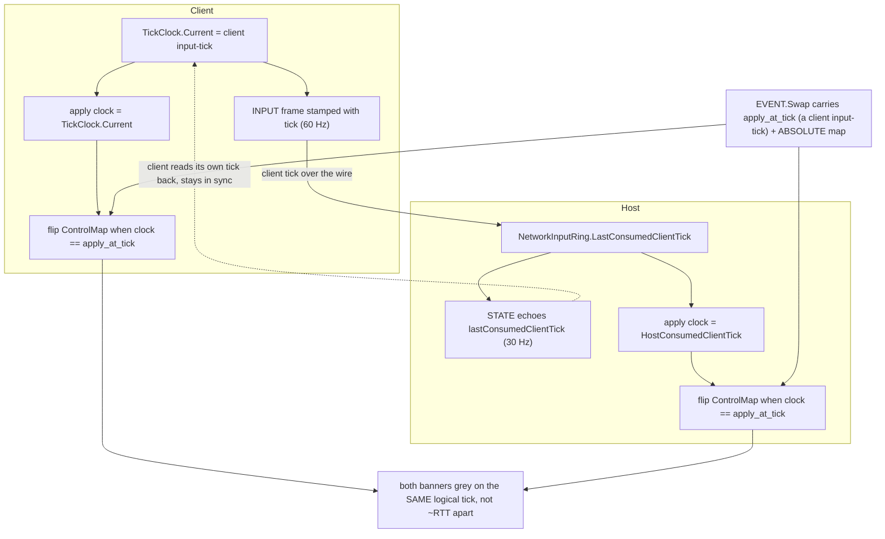
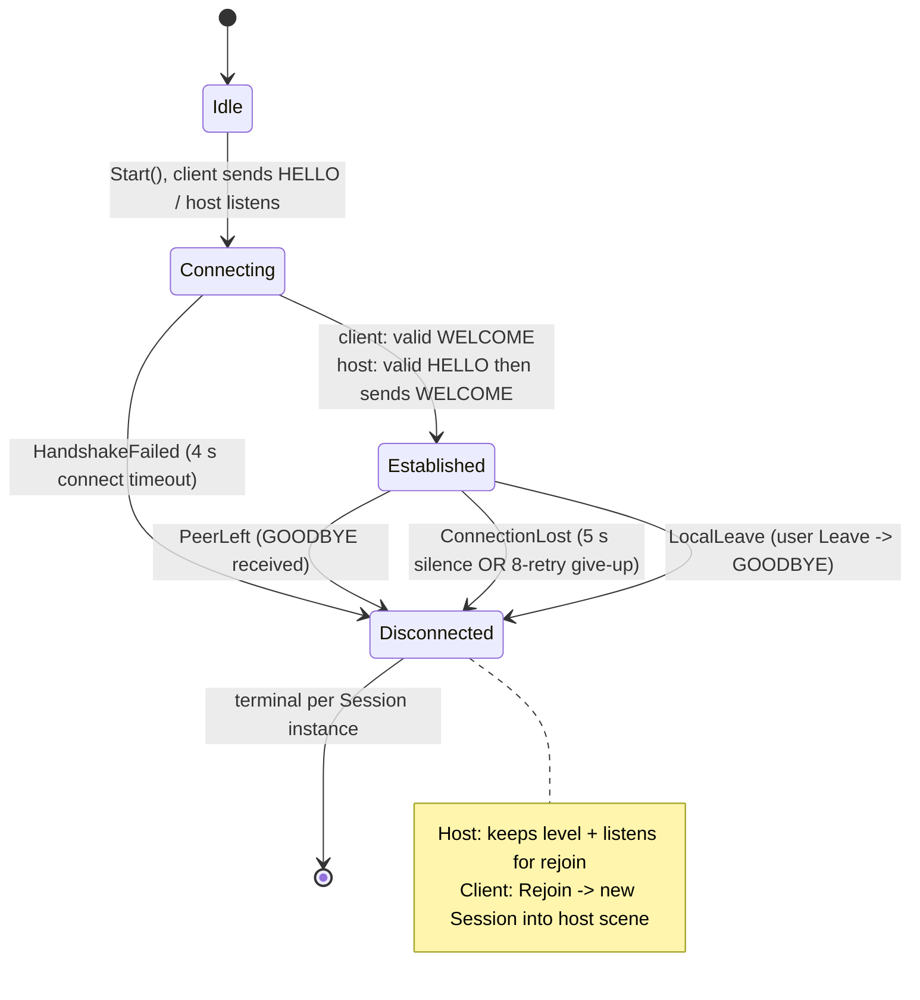

# Networking

[← README](../README.md) · **Networking** · [Architecture](architecture.md) · [Gameplay](gameplay.md)

A host-authoritative listen-server: one player hosts and runs the **only** authoritative simulation; the
other connects as a client, forwards input, and renders the host's state. P2P lockstep was rejected
(Unity's `Rigidbody2D` isn't deterministic across machines); a dedicated server is overkill for two-player
LAN. TCP was rejected because head-of-line blocking would stall realtime packets after a single loss,
exactly the failure mode the custom reliability layer is built to avoid.

This document covers the hand-rolled UDP stack end to end. For the assembly boundary and CI that keep all
of it engine-free and testable, see [Architecture](architecture.md).

---

## The wire: a fixed header and two channels

Every datagram opens with a fixed **11-byte big-endian header** (`type`, `seq`, `ack`, `ack_bits`,
`timestamp`). Reliable messages insert a **2-byte per-message sequence** between the header and the body,
the design's defining decision (see [Reliability](#reliability-per-message-seq-piggybacked-acks-rtt-timed-retransmit)).
The header's `seq` is reused only for unreliable latest-wins; the `ack`/`ack_bits` acknowledge
**message-seqs**, not packet-seqs.



<sub>Every datagram begins with the fixed 11-byte header; reliable messages insert a 2-byte per-message seq that `ack`/`ack_bits` acknowledge, while the header seq drives only unreliable latest-wins.</sub>

Eight message types split across the two channels by a **single predicate** (`IsReliable`), so the
invariant "EVENT is never unreliable, INPUT/STATE never reliable" is structurally hard to violate. A missed
`STATE` self-heals on the next snapshot ~33 ms later (latest-wins discards the stale one anyway); a missed
**swap** would desync the HUD from the authoritative `ControlMap` *permanently*, that asymmetry is the
whole justification for hand-rolling a per-message reliability layer instead of reaching for TCP.



<sub>The strict unreliable/reliable split: `INPUT`/`STATE`/`PING`/`PONG` are lossy; `HELLO`/`WELCOME`/`GOODBYE` and the `EVENT` union are sequenced, acked, and retransmitted.</sub>

**Body formats (as-built).** `INPUT` = `baseTick(u32)` + `count(u8)` + up to 6 packed 1-byte input frames
(each frame: bits for moveLeft/moveRight/jumpPressed/jumpHeld/dashPressed). `STATE` is 61 bytes:
`snapshotTick` + `lastConsumedClientTick` + `deathCount` + `sceneIndex` + `ControlMap(3 B)` +
`remoteInputFrame(1 B)` + a 46-byte `MovementState`. `EVENT` is a discriminated union keyed on
`EventKind { LevelLoad, Swap, Death, LevelReady }`. The wire formats are **forward-compatible by
reserve-and-tolerate**, `MovementState`'s trailing padding bytes and the input frame's reserved bits let a
newer sender append fields an older reader silently ignores, so new facts go on the wire without a version
bump. Every deserializer is bounds-checked and **returns `false` instead of throwing** on a short or
malformed buffer; out-of-range enum bytes are rejected (no conjuring a fake "P3" owner from a corrupt
`STATE`), and a malformed datagram is still mined for its piggybacked acks and liveness timestamp before
being dropped, the receive loop cannot be crashed by a short packet.

---

## Reliability: per-message seq, piggybacked acks, RTT-timed retransmit

Reliability keys on a **stable per-message sequence number**, not the packet-seq the header carries, this
is what lets a reliable `EVENT` survive loss and out-of-order arrival without head-of-line-blocking the
unreliable `INPUT`/`STATE` traffic sharing the same socket.

- **Acks are free-riders.** `ack`/`ack_bits` are written onto **every** outbound datagram and harvested
  from **every** inbound one before any payload handling, so a 60 Hz `INPUT` stream and a 30 Hz `STATE`
  stream constantly confirm reliable delivery without dedicated ack packets. `ack_bits` is a 16-entry
  redundancy window (bit *n* acks `ack - 1 - n`), so one delivered ack can clear several pending messages
  even if intervening acks were lost.
- **Retransmission is RTT-adaptive**, not a fixed timer: `RTO = clamp(2·SRTT, 50 ms, 500 ms)` with
  per-message exponential backoff (up to ×16). The SRTT is the classic TCP 1/8 EMA, so a single lag spike
  can't whipsaw the timer; the clamp floor stops a sub-millisecond LAN RTT from causing a retransmit storm,
  the ceiling stops a degraded link from waiting seconds. RTT itself comes from `PING`/`PONG` (the peer
  echoes the sender's timestamp).
- **Failure is bounded and explicit.** 8 retries (or a 64-message in-flight backlog) trips
  `OnDeliveryFailed`, which the transport treats as "the peer is gone" and disconnects, a swap that
  genuinely can't be delivered ends the session rather than letting the two HUDs silently desync. This is
  backstopped independently by a **5 s peer-silence timeout**.
- **The receive side delivers in contiguous order, exactly once**, holding out-of-order arrivals behind a
  gap and dropping duplicates and stale seqs.



<sub>Reliable messages hold under a stable message-seq, retransmit on an RTT-adaptive backed-off timer, get cleared by acks piggybacked on any inbound datagram, and declare the session lost after 8 retries; the receive side re-sequences and de-duplicates.</sub>

---

## INPUT: redundancy instead of retransmission

Realtime input shouldn't wait a round-trip for a resend, so it defends against loss with **redundancy**.
Each 60 Hz `INPUT` datagram re-ships the last **K=6** input frames, so a press is in flight in six packets
at once and survives up to five consecutive drops. The subtle part is the host-side consume: it serves
**held** bits (movement) from the newest frame for minimum latency, but a momentary **edge** press
(jump/dash) might sit only in an older redundancy frame, so edges are **OR-ed across the whole unconsumed
window** and every frame in it is marked consumed, landing the press exactly once and never twice.



<sub>An edge press at tick 9 rides packets 9..14; even with packet 9 dropped, packet 10 re-delivers it. The host serves newest held bits for minimum latency but OR-s edge bits across the unconsumed window so the press survives up to K-1 consecutive drops and fires exactly once.</sub>

---

## Host sim + client prediction & reconciliation

The host is the single simulation at a fixed 60 Hz: it pairs the client's wire input with its own keyboard,
routes both through the `ControlMap` into one `EffectiveInput`, steps the deterministic `Movement.Step`, and
broadcasts the post-step state every even tick (~30 Hz). The `STATE` body smuggles two coordinates the
client needs to predict without a separate clock-sync protocol: the host's own input frame that tick (to
dead-reckon host-owned actions) and `lastConsumedClientTick` (the client's reconciliation replay anchor).



<sub>Client samples `INPUT` at 60 Hz; the host pairs both players' frames, applies the `ControlMap`, steps the deterministic `Movement.Step`, and broadcasts `STATE` every even tick (30 Hz) carrying the predictor's reseed anchors.</sub>

The client doesn't wait a round-trip for its **owned** actions: it runs the *same compiled* `Movement.Step`
each tick and, when a `STATE` arrives, **reconciles**: reseeds to the authoritative snapshot and replays
its buffered local inputs from the anchor forward, so a 100 ms-old correction doesn't erase the jumps
pressed since. A hole in the input ring (a skipped `FixedUpdate`) or an over-cap replay window bails to a
clean hard-snap rather than replaying garbage.

The standout as-built decision: **host-owned motion is interpolated, not extrapolated.** An earlier version
dead-reckoned the host's last direction between snapshots; under LAN lag that over/under-shot on reversals
and visibly jittered (a brief host tap became a predicted lunge, then a yank back). Host-owned motion now
advances only by gravity from the state-seeded velocity, and **visual smoothing** eases the sprite toward
each snapshot. Slightly-behind-but-smooth beat instant-but-jittery for motion that isn't the local
player's own input. Smoothing is surgically narrow: it injects **only** the reconcile discontinuity (so
ordinary input-driven motion contributes a zero correction and never smears), on a render-only child while
the collider/rigidbody stay at the true sim position so triggers and collisions stay exact. The offset
decays ~99% in ~140 ms; corrections past 4 units cut instantly (respawn, level load, post-stall snap).



<sub>Each tick the client predicts its owned inputs forward; on a fresh `STATE` it reseeds to authority and replays buffered inputs, smoothing only the reconcile discontinuity, holding the pose under a stall and hard-snapping on a hole or over-cap window.</sub>

Failure modes degrade gracefully: a prolonged `STATE` stall (heavy loss) makes the predictor **hold** the
last pose past 64 forward ticks rather than free-run off-screen and snap back. Host death is authoritative
on the client too: it holds at the death pose and hard-cuts to the respawn so local input can't walk the
body through a spike during the host's 0.4 s death freeze (the host keeps the wire warm through that freeze
by broadcasting the frozen `isDead` pose).

---

## The control-swap EVENT (the centerpiece)

The control swap is the academic payload of the reliable channel. The host owns the only authoritative
`ControlMap`; when the character enters a `SwapTrigger`, the host composes a **new absolute map**, picks a
future `apply_at_tick` (= current client-input-tick + a 6-20-tick telegraph lead), schedules it locally,
**and** sends a reliable `EVENT{ Swap, apply_at_tick, absolute map, triggerId }`. Because the map is
**absolute** (a full owner triple, not a toggle) and the transport delivers exactly-once in-order, a
retransmitted or double-applied swap is **idempotent**, so there's no per-event dedup id at all. Death and
level transitions ride the same reliable path, and the ordering of that single stream is load-bearing: a
`Death` delivered after the swaps it supersedes lets the client cancel pending swaps and snap to the
checkpoint map without a late swap re-corrupting ownership.

```mermaid
sequenceDiagram
    participant T as SwapTrigger (host sim)
    participant D as SwapScheduleDriver (host)
    participant H as PendingSwapScheduler (host)
    participant N as NetworkManager / Reliable transport
    participant CS as PendingSwapScheduler (client)
    participant CM as ControlMapStore + HUD (each end)
    Note over T: character enters volume; Authority.IsHost gates client out
    T->>D: OnSwapRequested(action, triggerId)
    D->>D: applyTick = clientTick + lead (6..20)
    D->>D: map = WithSwap(PendingFinalMap, action)  [ABSOLUTE]
    D->>H: Schedule(applyTick, map, triggerId)
    D->>N: SendSwapEvent(applyTick, map, triggerId)
    N->>CS: EVENT{Swap, applyTick, absolute map, triggerId} (reliable, seq+ack+retransmit)
    CS->>CS: Schedule(applyTick, map, triggerId)
    Note over H,CS: each end's FixedUpdate runs OnTick(localClock)
    H->>CM: host LastConsumedClientTick == applyTick -> Apply(map) + GreyById
    CS->>CM: client TickClock == applyTick -> Apply(map) + GreyById
    Note over CM: both HUD banners grey on the SAME tick
```

<sub>A swap fires host-side, ships one absolute, reliable `EVENT`, and both ends schedule then flip the `ControlMap` on the same `apply_at_tick`.</sub>

Both screens flip **together** because `apply_at_tick` is denominated in the one clock both ends share, the
client's input-tick. The client stamps its tick on every `INPUT`; the host echoes its last-consumed value
of that tick back in every `STATE`. Each end then independently flips its `ControlMap` the instant its own
copy of that counter reaches `apply_at_tick`, no extra round-trip, no "apply now" message that would itself
arrive ~RTT late. The telegraph lead floors at ~6 ticks for readability and, when hosting, stretches toward
`ceil(RTT/dt)+2` so the `EVENT` physically reaches the client before the shared apply tick even on a stress
lag profile. The banner greys on the **apply tick** (not on physical entry, which is RTT-early on the host
and invisible to the client), reinforcing the shared-clock illusion.



<sub>`apply_at_tick` is denominated in the client input-tick both ends share (client stamps `INPUT`; host echoes it in `STATE`), so each end flips independently yet simultaneously.</sub>

---

## Session lifecycle, LAN discovery & failure recovery

A `Session` is the sole authority on whether a session is up, driving a four-state FSM off **validated**
handshake bodies (not the transport's raw "saw a datagram" flag), so a stray packet from a wrong-version
or junk sender can never be mistaken for an established peer. The client speaks first with `HELLO`; the host
validates and replies `WELCOME` (enriched with the peer's slot and the host's current scene index, so a
mid-game join lands in the right level). `Disconnected` is terminal per instance and **stamps a reason**,
`PeerLeft` (a received `GOODBYE`), `ConnectionLost` (a 5 s silence timeout *or* the 8-retry give-up), or
`LocalLeave`, which determines the recovery UX. Recovery is **resumable, not fatal**: the host keeps its
level/pose/score and flips back into listen mode, so a client **Rejoin** reconnects straight into the host's
current level via the same `WELCOME` scene-index path.



<sub>The `Session` FSM: client speaks first with `HELLO`, host replies `WELCOME`; `Disconnected` is terminal and stamps a reason that determines the recovery UX.</sub>

LAN discovery is a separate, **best-effort** layer: the host broadcasts a ~1 Hz beacon to `255.255.255.255`
advertising game magic, a display name (the lobby name), and the gameplay port; clients dedupe and expire
heard hosts (4 s TTL) into a connect list, with **manual IP** as the reliable fallback (many real networks, such as phone hotspots or AP/client isolation, drop broadcast). The beacon's game magic lets clients ignore foreign
traffic on the discovery port.

On each level transition a **2 s level-load barrier** freezes the host sim and withholds `STATE` until the
client acks the new scene with a `LevelReady` `EVENT`, closing the window where the host would simulate into
a scene the client hasn't loaded (the client's collision casts would hit nothing and the character would
fall through the floor). The barrier sits *below* the 5 s liveness timeout on purpose: a dropped ack resumes
the host best-effort after 2 s (the link is probably fine, the ack just dropped), while a genuinely dead peer
is left for the liveness path to declare lost.

```mermaid
sequenceDiagram
    participant H as Host
    participant LAN as "255.255.255.255:47777"
    participant C as Client
    Note over H,C: Discovery + handshake
    loop every 1 s
        H->>LAN: beacon (magic, name, gameplayPort)
        LAN-->>C: beacon
        C->>C: dedupe + list host (TTL 4 s)
    end
    C->>H: HELLO (magic, version)
    Note over H: PollForHello validates then LatchPeer (pre-seed)
    H->>C: WELCOME (accepted, P2, sceneIndex)
    Note over H,C: Both Established; PING -> 1 Hz
    Note over H,C: Level-load barrier (2 s)
    H->>C: EVENT LevelLoad(scene N)
    H->>H: SimPaused = true, withhold STATE
    C->>C: additive load scene N
    C->>H: EVENT LevelReady(scene N)
    H->>H: ClearBarrier -> resume sim + STATE
```

<sub>Host beacons ~1 Hz so the client can list and connect, then `HELLO`/`WELCOME` establishes; on each level the host freezes its sim until the client acks the scene via `LevelReady` (2 s timeout).</sub>

**Liveness is kept warm cheaply:** during the handshake/listen phase `PING` runs at ~5 Hz (the only traffic
on the wire); once Established, `INPUT` (60 Hz) and `STATE` (30 Hz) flow constantly, so `PING` drops back to
1 Hz, any inbound datagram, not just `PONG`, resets the liveness clock.

**Network-condition simulator.** To exercise all of the above under latency/loss, an editor-only
`NetworkConditionChannel` decorates the outbound channel behind the `IDatagramChannel` seam (see
[Architecture](architecture.md)). The menu's `Sim:` button cycles **Clean / Fair / Stress** per instance.
Profiles are one-way latency / jitter / loss: Fair ≈ 75 ms / 20 ms / 5%, Stress ≈ 125 ms / 50 ms / 10%
(RTT ≈ 2× the one-way latency). It compiles out of player builds and rolls its own LCG (not `System.Random`,
whose stream differs between Unity Mono and the net8.0 CI) so a seed reproduces the same loss pattern
everywhere.
